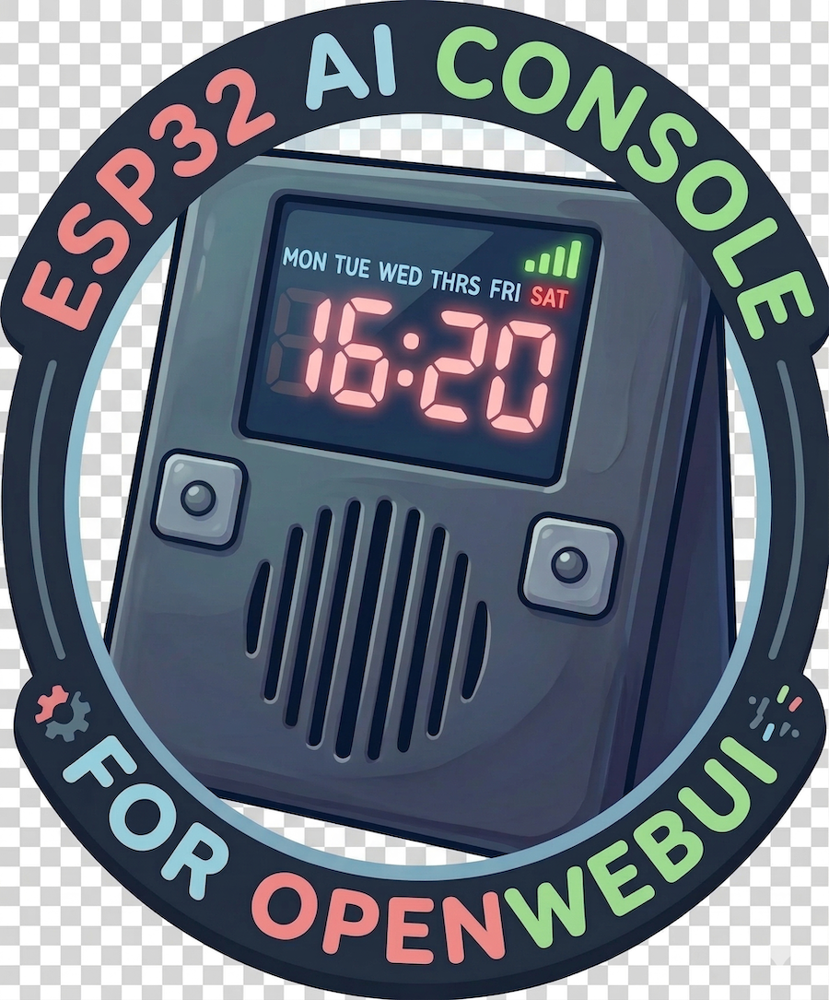

<p align="center">
  
</p>

# ESP32 AI Module Firmware (AI Interactor)

A powerful, fully-featured AI Voice Assistant built on the ESP32-S3. This project seamlessly integrates Large Language Models (LLMs), Text-to-Speech (TTS), Wake Word detection, and Acoustic Echo Cancellation (AEC) into a standalone hardware module with a beautiful touch UI.

Created by **Jordan Rubin** ([Retro Tech & Electronics](https://www.youtube.com/@retrotechandelectronics)).

---

## 🌟 Features

- **Always-Listening Wake Word:** Powered by Edge Impulse machine learning (`hey_espy`).
- **Acoustic Echo Cancellation (AEC):** Uses SpeexDSP to cancel out the device's own speaker audio, allowing you to interrupt the AI while it is speaking (Voice Barge-in).
- **LLM Integration:** Compatible with any OpenAI-format API endpoint (OpenWebUI, Local LLaMA, GPT-4, etc.).
- **Text-to-Speech (TTS):** Streams high-quality audio responses directly to an I2S speaker using Kokoro/OpenWebUI or direct URL providers.
- **LVGL Touch Interface:** Rich graphical user interface featuring a status display, VU meters, settings menus, and dynamic clock/weather screens.
- **Web Configuration Portal:** A built-in captive portal and admin web server to manage API keys, WiFi, AEC tuning, and OTA updates without recompiling.
- **Diagnostic Suite:** Built-in serial commands and web tools to generate sine sweeps, test microphone harmonics, and auto-tune the AEC alignment.

---

## 🛠️ Hardware Requirements

- **Microcontroller:** ESP32-S3 (Recommended: 16MB Flash, 8MB PSRAM like `esp32-s3-devkitc1-n16r8`).
- **Microphone:** I2S MEMS Microphone (e.g., ICS-43434 or INMP441).
- **Speaker/DAC:** I2S Amplifier/DAC (e.g., MAX98357A) connected to a 4Ω/8Ω speaker.
- **Display:** SPI/Parallel TFT Display with Touch (Code natively supports ILI9481 via `Arduino_GFX` and XPT2046 for touch).
- **Status LED:** WS2812B / NeoPixel RGB LED.

---

## ⚙️ Software & Dependencies

This project is built using **PlatformIO** and the Arduino framework.

### Core Libraries:
- `lvgl/lvgl` (^8.3.11) - Graphics library
- `bblanchon/ArduinoJson` - JSON parsing
- `moononournation/GFX Library for Arduino` - Display drivers
- `paulstoffregen/XPT2046_Touchscreen` - Touch controller
- `rjsachse/ESP32-SpeexDSP` - Hardware-accelerated AEC and noise suppression
- `pschatzmann/arduino-libhelix` - MP3 audio decoding
- `ESP-ai-wakeword_inferencing` - Edge Impulse ML library (Custom generated)

---

## 🚀 Installation & Setup

1. **Clone the Repository:**
   ```bash
   git clone https://github.com/yourusername/ESP32-AI-Module.git
   cd ESP32-AI-Module
   ```
2. **Open in PlatformIO:**
   Open the folder in VSCode with the PlatformIO extension installed.
3. **Upload Filesystem Image:**
   Upload the LittleFS filesystem image to flash required assets like `chime.mp3`.
   *In PlatformIO: Click the Alien icon -> `esp32-s3-devkitc1-n16r8` -> Platform -> Build Filesystem Image -> Upload Filesystem Image.*
4. **Compile and Upload:**
   Build and upload the firmware to your ESP32-S3.

### Initial Configuration
On first boot, the device will host a WiFi access point. 
1. Connect to the setup WiFi network.
2. Navigate to `http://aiesp.local` or the displayed IP address.
3. Set up your local WiFi credentials, API keys, and LLM endpoint.
4. (Optional) Run the Touch Calibration if prompted on the screen.

---

## 🎙️ AEC & Audio Tuning

Because every speaker/microphone hardware combination has a different physical delay (distance + I2S latency), the Acoustic Echo Cancellation (AEC) must be tuned to your specific build.

You can easily auto-tune the AEC through the Web UI Diagnostics tab or via the Serial Monitor:

1. Open the Serial Monitor (115200 baud).
2. Send the command `/tune_aec`.
3. The device will play test tones, record them, and mathematically calculate the exact delay, attenuation, and cutoff gate needed to prevent the AI from triggering its own wake word.

---

## 💻 Serial Commands

The firmware includes a robust serial CLI for debugging and diagnostics. Send these commands via the PlatformIO serial monitor:

| Command | Description |
|---------|-------------|
| `/help` | List all available commands. |
| `/settings` | Print all current NVRAM settings and thresholds. |
| `/say <text>` | Bypasses the LLM and instantly plays the provided text via TTS. |
| `/new` | Clears the current LLM conversation memory/history. |
| `/calibrate` | Forces the touch screen calibration utility to run. |
| `/tune_aec` | Runs the automated Acoustic Echo Cancellation tuning routine. |
| `/test_aec` | Records two 10-second clips (with and without AEC) to test isolation. |
| `/test_mic` | Records a 5-second clip to LittleFS and plays it back to verify hardware. |
| `/test_harmonic` | Plays a 20-second sine sweep to test microphone clipping and resonance. |
| `/factory_reset`| Wipes all NVRAM settings, clears WiFi, and reboots. |

*Tip: You can also hold the physical `BOOT` button (GPIO 0) for 3 seconds during startup to trigger a factory reset.*

---

## 🧠 Edge Impulse (Custom Wake Words)

This project supports training your own wake words using Edge Impulse. 
If you want to gather audio samples directly from the device's specific microphone:
1. Go to the Web UI -> Diagnostics Tab.
2. Click **Reboot to Edge Impulse Data Collection**.
3. Open your PC terminal and run `edge-impulse-data-forwarder`.
4. The ESP32 will stream raw I2S audio over serial directly to your Edge Impulse project.

---

## 📄 License

This project is provided as-is for educational and hobbyist use.
Please respect the licensing of the included sub-libraries (LVGL, ArduinoJson, SpeexDSP, etc.).

**Designed by Retro Tech & Electronics (2026)**