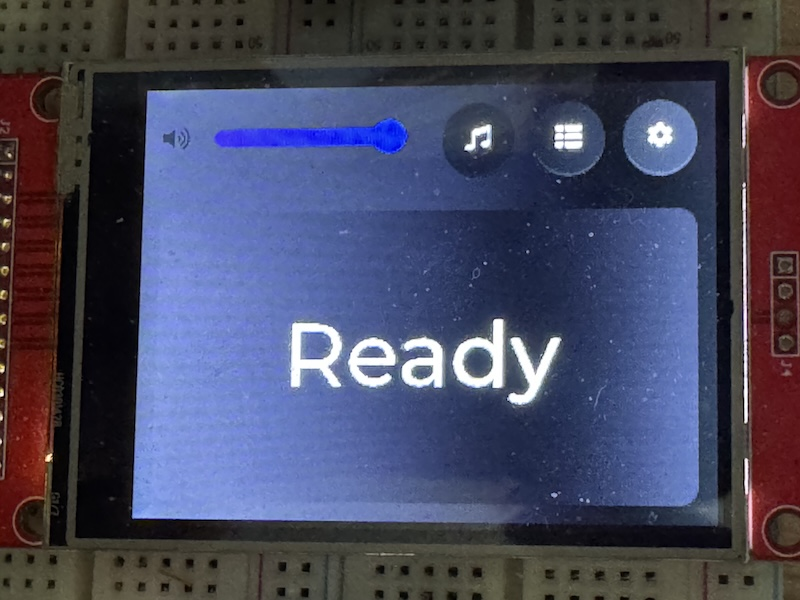
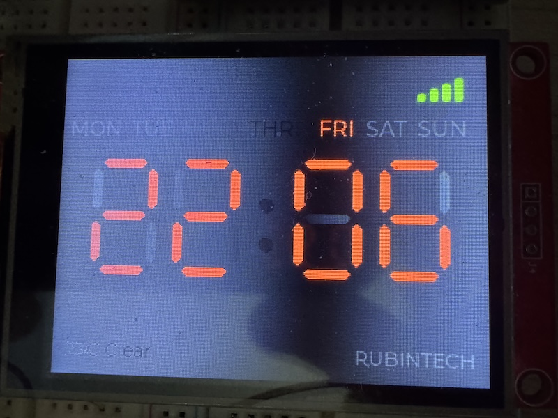
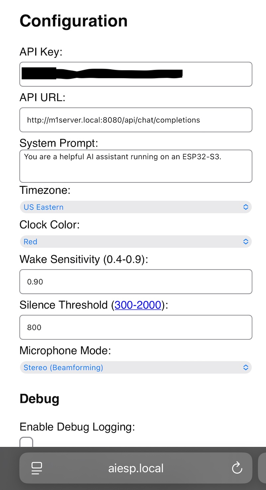
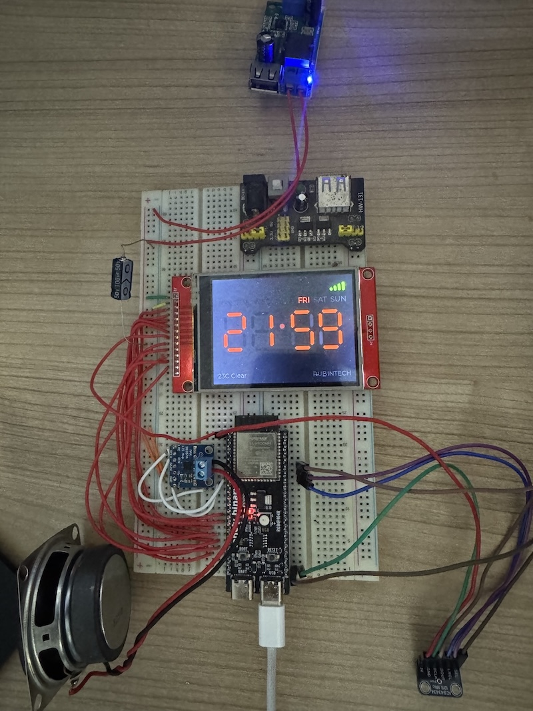

# ESP32-S3 AI Voice Assistant

A fully integrated, voice-controlled AI assistant running on the ESP32-S3. This project combines on-device wake-word detection, speech-to-text, Large Language Model (LLM) intelligence, and text-to-speech into a standalone hardware device with a rich touch interface.

## Features

*   **Voice Activation**: On-device wake word detection using Edge Impulse (default: "Hey Espy").
*   **Conversational AI**: Integrates with OpenAI-compatible APIs. Designed for local LLM servers (Ollama, LocalAI) but compatible with cloud providers.
*   **Advanced Audio Pipeline**:
    *   **Input**: I2S Microphone support (ICS-43434) with software Acoustic Echo Cancellation (AEC) and Beamforming.
    *   **Output**: I2S Amplifier (MAX98357A) for high-quality Text-to-Speech playback.
    *   **Processing**: SpeexDSP integration for noise suppression and echo cancellation.
*   **Interactive Display**:
    *   3.2" ILI9341 Touchscreen running LVGL.
    *   Real-time clock, live weather updates (OpenWeatherMap), and WiFi signal status.
    *   Visual feedback: Audio VU meters, thinking animations, and status logs.
*   **Web Configuration**: Comprehensive web interface for setting up WiFi, API keys, System Prompts, and Audio tuning.
*   **Customizable**: Change wake sensitivity, system prompts, voices, and volume on the fly.

## Gallery

| Main Interface | Clock Mode | Web Config |
| :---: | :---: | :---: |
|  |  |  |

*Early development*

## Hardware Requirements

*   **MCU**: ESP32-S3 (DevKitC-1 or compatible) - **Must have PSRAM**.
*   **Display**: ILI9341 TFT Display (SPI) with XPT2046 Touch Controller.
*   **Audio Input**: ICS-43434 I2S Microphone (Stereo capable recommended for AEC).
*   **Audio Output**: MAX98357A I2S Amplifier + Speaker.
*   **Misc**: RGB LED (NeoPixel/WS2812B) for status indication.

## Pin Configuration

| Component | Pin (ESP32-S3) | Description |
| :--- | :--- | :--- |
| **Display** | | |
| TFT_CS | 15 | Chip Select |
| TFT_DC | 2 | Data/Command |
| TFT_RST | -1 | Reset (or 3.3V) |
| TFT_SCK | 14 | SPI Clock |
| TFT_MOSI | 13 | SPI MOSI |
| TFT_MISO | 12 | SPI MISO |
| TFT_BL | 4 | Backlight (PWM) |
| **Touch** | | |
| TOUCH_CS | 33 | Chip Select |
| TOUCH_IRQ | 36 | Interrupt |
| **Audio In** | | |
| I2S_SCK | 42 | BCLK |
| I2S_WS | 41 | LRCLK |
| I2S_SD | 40 | DIN |
| **Audio Out** | | |
| SPK_SCK | 18 | BCLK |
| SPK_WS | 17 | LRCLK |
| SPK_SD | 16 | DOUT |

## Software Architecture

The system operates in a continuous loop:
1.  **Listen**: The ESP32 listens for the wake word using a lightweight Edge Impulse model running on the DSP.
2.  **Record**: Upon trigger, audio is recorded to PSRAM. AEC is applied in real-time to cancel out any system audio (like music or previous speech).
3.  **Transcribe**: The recorded WAV is sent via HTTP POST to a Speech-to-Text (STT) endpoint (e.g., Whisper).
4.  **Think**: The transcribed text is sent to an LLM endpoint (e.g., Llama 3.2 via Ollama).
5.  **Speak**: The AI's response is sent to a Text-to-Speech (TTS) endpoint (e.g., Kokoro-82M) and played back via I2S.

## Setup & Installation

### 1. Firmware Upload
This project uses **PlatformIO**.
1.  Clone the repository.
2.  Open in VS Code with the PlatformIO extension.
3.  **Upload Filesystem Image**: This uploads `chime.mp3` and other assets to the LittleFS partition.
    *   *PlatformIO Task -> Platform -> Upload Filesystem Image*
4.  **Upload Firmware**: Build and flash the main application.
    *   *PlatformIO Task -> General -> Upload*

### 2. Backend Setup
The device requires an OpenAI-compatible API backend. A recommended local setup using Docker:
*   **LLM**: Ollama or LocalAI running `llama3.2` or similar.
*   **STT/TTS**: A container providing OpenAI-compatible `/v1/audio/transcriptions` and `/v1/audio/speech` endpoints (e.g., using Whisper and Kokoro).

### 3. Initial Configuration
1.  Power on the device.
2.  If WiFi is not configured, the screen will prompt you to connect.
3.  Connect to the device's Access Point (if AP mode active) or find the IP in the Serial Monitor.
4.  Navigate to `http://aiesp.local` or the device IP address.
5.  **Default Login**: `admin` (Password is set on first boot via Serial or Touch UI).

## Configuration Guide

### Web Interface
Access `http://aiesp.local` to configure:
*   **API Settings**: URL and Key for your LLM backend.
*   **System Prompt**: Define the personality of your assistant.
*   **Weather**: OpenWeatherMap API key and location.
*   **Audio**: Microphone mode (Stereo/Left/Right), Wake Word sensitivity, and Silence threshold.
*   **Debug**: Enable verbose serial logging.

### Serial Commands
Connect via USB Serial (115200 baud) for advanced control:

| Command | Description |
| :--- | :--- |
| `/help` | List all available commands |
| `/settings` | Show current network, audio, and system settings |
| `/calibrate` | Start the touchscreen calibration utility |
| `/say <text>` | Force the device to speak specific text immediately |
| `/new` | Clear the current conversation history context |
| `/debug_aec` | Toggle Acoustic Echo Cancellation debug stats |
| `/test_mic` | Record a 5s clip and play it back (Debug mode only) |
| `/test_aec` | Run a full AEC diagnostic suite (Debug mode only) |

## Troubleshooting

**Touchscreen is inaccurate:**
Run `/calibrate` in the serial terminal or reset calibration via `/reset_cal`.

**Wake word not triggering:**
1.  Check `Wake Thresh` in settings (lower is more sensitive).
2.  Ensure the microphone is connected correctly.
3.  Use `/test_mic` to verify audio recording quality.

**Audio feedback/Echo:**
1.  Ensure `Microphone Mode` is set to **Stereo** if using a stereo mic, as AEC requires a reference signal.
2.  Use `/aec_gain` to adjust the reference signal volume for the canceller.

**"API Check Failed":**
Ensure your backend server is reachable from the ESP32's IP address. If using a local server, use the computer's IP (e.g., `192.168.1.x`), not `localhost`.

## License

MIT License. See `LICENSE` file for details.

## Credits

*   **Jordan Rubin** - Lead Developer
*   **Retro Tech & Electronics** - Project Inspiration & Hardware Design
*   **Edge Impulse** - Wake Word Model
*   **LVGL** - Graphics Library
*   **SpeexDSP** - Audio Processing

---
*2026 Jordan Rubin*